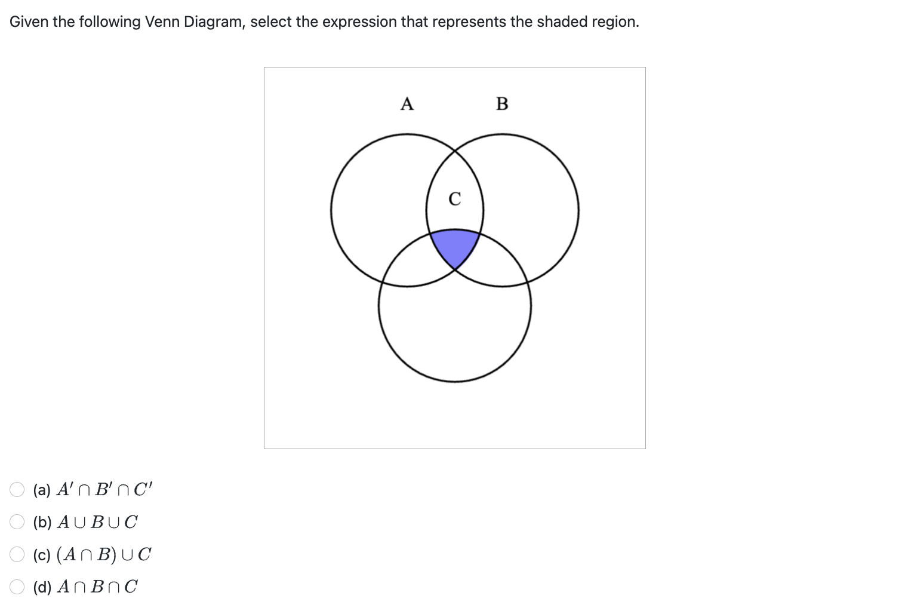
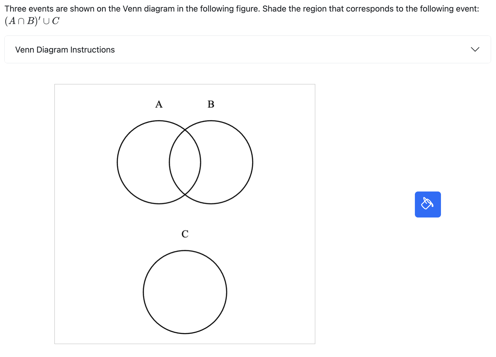
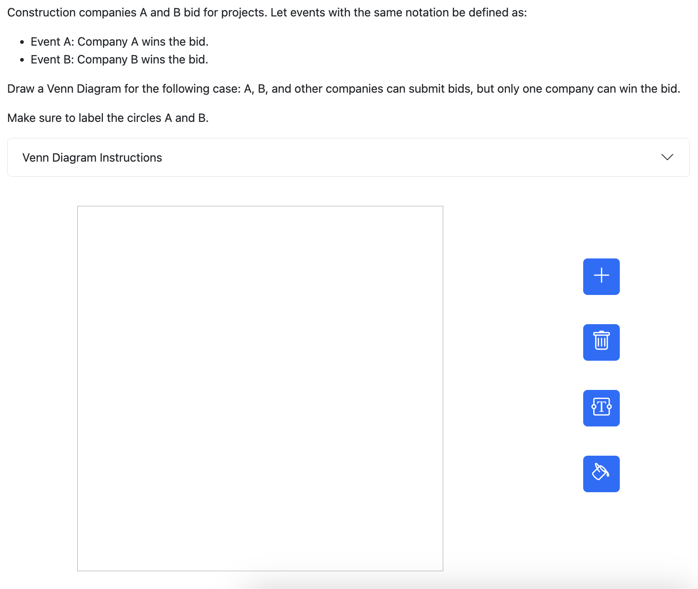

# PrairieLearn OER Element: Venn Diagram

This element was developed by Noah Gersich, Brian Yoon, and Keerthana Sunder. Please carefully test the element and understand its features and limitations before deploying it in a course. It is provided as-is and not officially maintained by PrairieLearn, so we can only provide limited support for any issues you encounter!

If you like this element, you can use it in your own PrairieLearn course by copying the contents of the `elements` folder into your own course repository. After syncing, the element can be used as illustrated by the example question that is also contained in this repository.


## `pl-drawing-venn` element

This element creates a canvas for Venn diagrams that can be used both for interactive questions and to display instructional materials. Overlapping regions in the diagram can be colored, and the correct placement and coloring of regions can be auto-graded.


### Example 1: Non-interactive instructional material



```html
<pl-drawing-venn gradable="false" width="400" height="400">
    <pl-circle-venn x1="150" y1="150" label="A"></pl-circle-venn>
    <pl-circle-venn x1="250" y1="150" label="B"></pl-circle-venn>
    <pl-circle-venn x1="200" y1="250" label="C"></pl-circle-venn>
    <pl-region-venn region="A&B&C"></pl-region-venn>
</pl-drawing-venn>
```

### Example 2: Interactive coloring of an existing diagram



```html
<pl-drawing-venn answers-name="venn" disable-labeling="true" disable-movement="true" correct-answer="~(A&B)|C">
    <pl-drawing-venn-initial>
        <pl-circle-venn x1="200" y1="150" label="A"></pl-circle-venn>
        <pl-circle-venn x1="300" y1="150" label="B"></pl-circle-venn>
        <pl-circle-venn x1="250" y1="400" label="C"></pl-circle-venn>
    </pl-drawing-venn-initial>
</pl-drawing-venn>
```

### Example 3: Fully interactive drawing and coloring of a diagram



```html
<pl-drawing-venn answers-name="venn" include-sample-space="true" correct-answer="~(A&B)">
    <pl-circle-venn x1="200" y1="150" label="A"></pl-circle-venn>
    <pl-circle-venn x1="300" y1="150" label="B"></pl-circle-venn>
</pl-drawing-venn>
```

Note that the shading of both non-interactive and interactive diagrams is limited to regions where at most 3 circles overlap. A warning will be displayed if students try to create diagrams with more overlapping areas, and pre-defined canvases with such overlaps may not work as expected.


### Element Attributes

| Attribute | Type | Description |
|-----------|------|-------------|
| `answers-name` | string (required) | Unique name for the element. |
| `width` | integer (default: `500`) | Horizontal width of the canvas (in pixels). |
| `height` | integer (default: `500`) | Vertical height of the canvas (in pixels). |
| `circle-radius` | integer (default: `80`) | The radius of the circles (in pixels) in the canvas. |
| `gradable` | boolean (default: `true`) | If set to `true`, the element is interactive and will be graded. Otherwise, the diagram will be used for display only. |
| `correct-answer` | string (required if gradable) | Only relevant if `gradable` is `true`. Correct coloring of regions to be checked during grading. This should be specified as an expression that uses the labels of circles and set operators (e.g., `A&B` if the overlapping region of the circles A and B must be colored in a correct answer). The following set operations are supported: complement (`~` or `!`), union (`_U_`, `_u_`, or `\|`), intersection (`^`, `&`, `_i_`, or `_I_`), and set difference (`-`). Alternatively, this can also be specified as a list of unions in square brackets (e.g., `[A^B, B^C]` is equivalent to `(A^B) \| (B^C)`). |
| `disable-insertion` | boolean (default: `false`)  | Only relevant if `gradable` is `true`. If set to `true`, students will not be able to insert and delete circles in the canvas. |
| `disable-movement` | boolean (default: `false`)  | Only relevant if `gradable` is `true`. If set to `true`, students will not be able to move circles in the canvas. Disabling circle movement also disables insertion. |
| `disable-labeling` | boolean (default: `false`)  | Only relevant if `gradable` is `true`. If set to `true`, students will be unable to label circles in the canvas. |
| `disable-shading` | boolean (default: `false`)  | Only relevant if `gradable` is `true`. If set to `true`, students will be unable to shade circles in the canvas. |
| `hide-score-badge` | boolean (default: `false`) | Only relevant if `gradable` is `true`. If set to `true`, no score badge will be shown above the canvas to give students feedback on their submission. |
| `hide-answer-panel` | boolean (default: `false`) | Only relevant if `gradable` is `true`. If set to `true`, the correct answer is not shown to students after they submit their answer. |
| `hide-help-text` | boolean (default: `false`) | Only relevant if `gradable` is `true`. If set to `true`, the help text that contains the instructions on how to use drawing canvas is disabled. |
| `disable-sample-space` | boolean (default: `false`)  | Only relevant if `gradable` is `true`. If set to `true`, students will not have the ability to shade the sample space. Additionally, the sample space will not be graded for correctness. |


### Drawing Venn diagrams inside `question.html`

To create a drawing, `pl-circle-venn` and `pl-region-venn` elements must be placed inside the `pl-drawing-venn` element to draw circles and shade overlapping regions. If `gradable` is set to `false`, these elements are immediately drawn to be used as question materials. If `gradable` is set to `true`, they are only shown in the answer panel (unless disabled, see `hide-answer-panel`). To provide a non-empty starting canvas for students if `gradable` is set to `true`, elements can be wrapped inside a `pl-drawing-venn-initial` element.


#### Sub-Element: `pl-circle-venn`

| Attribute | Type | Description |
|-----------|------|-------------|
| `x1` | integer (required) | The `x` position (in pixels) of the center of the circle (i.e. the horizontal distance from the left border of the canvas). |
| `y1` | integer (required) | The `y` position (in pixels) of the center of the circle (i.e. the vertical distance from the top border of the canvas). |
| `label` | string (required) | Unique label of the circle. Labels should be valid [Python identifiers](https://www.geeksforgeeks.org/python-keywords-and-identifiers/). |

#### Sub-Element: `pl-region-venn`

| Attribute | Type | Description |
|-----------|------|-------------|
| `region` | string (required)| A region of the diagram to shade. See the description of `correct-answer` above for more details. |


#### Sub-Element: `pl-drawing-venn-initial`

This element has no attributes. It is used to wrap `pl-circle-venn` and `pl-region-venn` elements that are initially shown on the canvas when `gradable=true`. 

The example below shows an instance where the initial canvas already contains one circle and students are expected to insert another circle.

```html
<pl-drawing-venn answers-name="venn" correct-answer="A^B">

  <pl-drawing-venn-initial>
    <pl-circle-venn x1="100" y1="100" label="A"></pl-circle-venn>
  </pl-drawing-venn-initial>

  <pl-circle-venn x1="200" y1="100" label="B"></pl-circle-venn>
</pl-drawing-venn>
```
